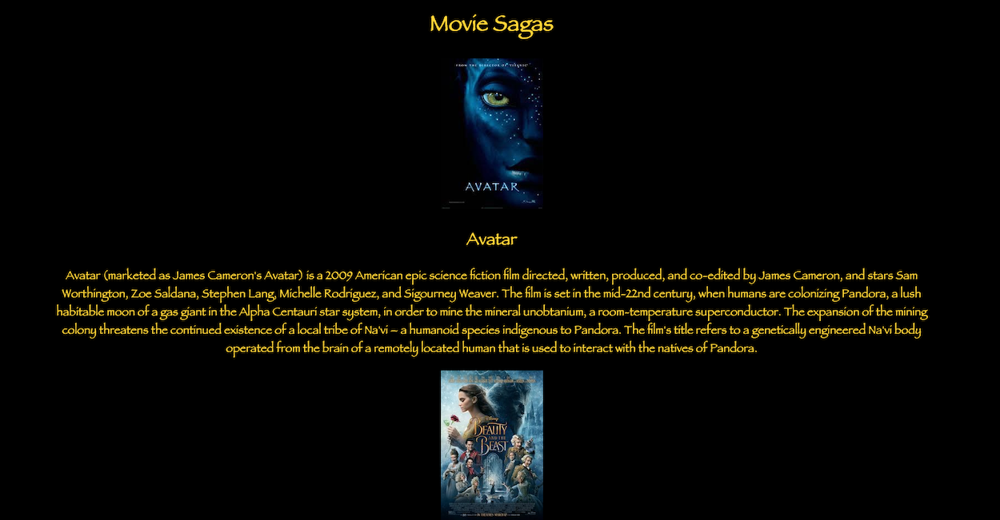
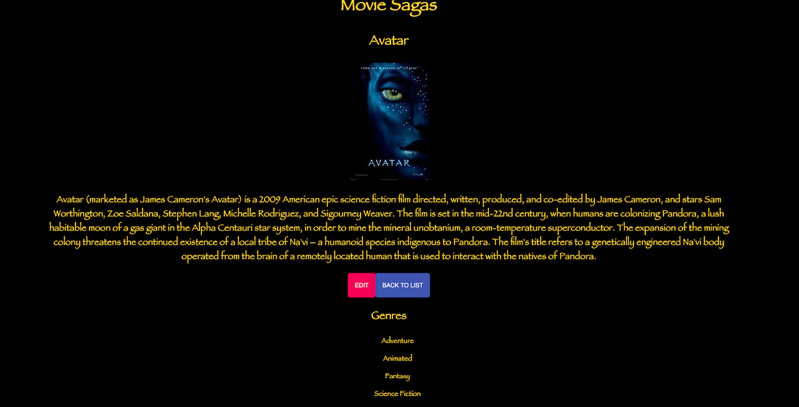
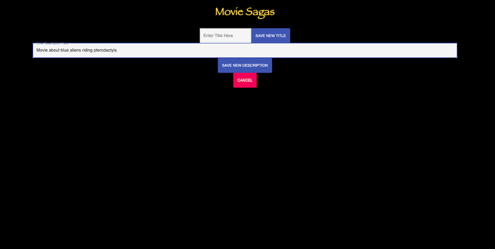
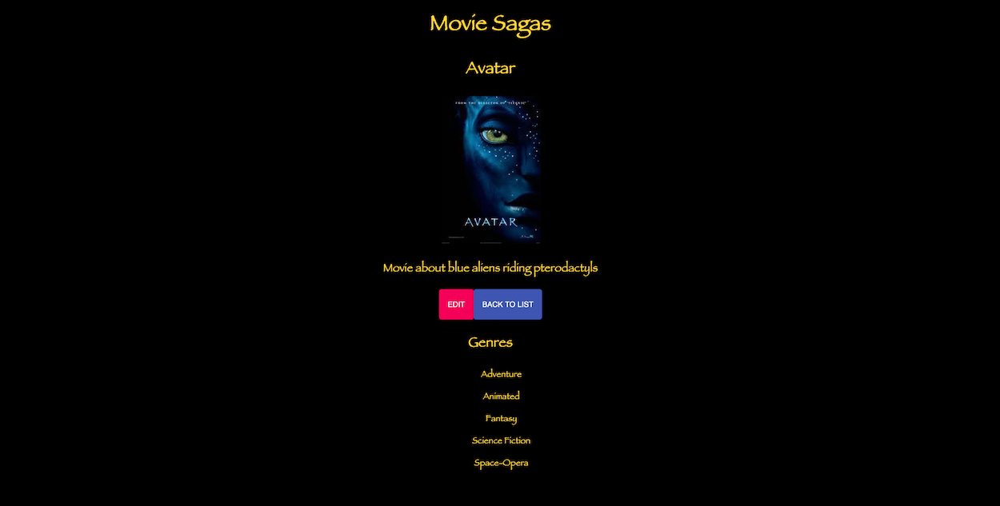

# Movie-Sagas

## Description 
Duration: 25 Hours

Movies-Sagas is a Single Page Application for storing movie information. Users can look up information on a movie including it's title, description, associated genres, and the movie's poster.
## Screenshots

## Installation
1. Run queries from database.sql file.
2. Run 'NPM install' in the terminal to install all dependencies.
3. Run 'NPM run server' in the terminal.
4. Open a second terminal and run 'NPM run client'.

## Usage
1. When the app loads you will automatically be navigated to the Home Page.
2. The Home Page will have a list of all the movies held in the database along with the movie poster and description of each title.
3. Clicking on the poster, title, or description will take you to the details page of that movie.
4. The details page will show the title, poster, and description. As well as a list of all genres associated with the movie, and buttons to navigate to an Edit Page or go back to the Home Page.
5. Clicking on the Back To List button will return you to the Home Page, Clicking on the Edit button will bring you to the Edit Page.
6. From here you can change the title or the description of the selected movie by typing in the associated input field and clicking on the Save New Title or Save New Description Button. After clicking on either button you will be returned to the Details Page to view your edited movie.
7. If you find yourself on the Edit Page by mistake simply click the Cancel button to return to the details page.

## Built With
React, Redux, html, CSS, Node, Express, Javascript, PostgreSQL, Logger, Body-Parser, Material-UI

## Acknowledgement
Thanks to Prime Digital Academy in Kansas City who equipped and helped me to make this application a reality. Specifically Scott, Myron, and the Tyto cohort.

## Support
If you have suggestions or issues, please email me at allenlucke@gmail.com
